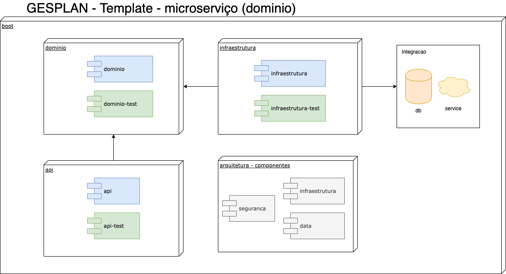
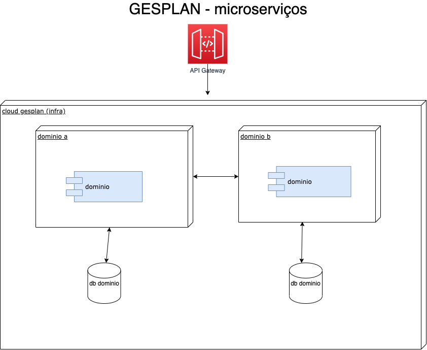

Microserviço Gesplan 

# Documentação
	Build
		docker-compose build
	Run
		docker-compose up

# Especificação
	1 - Hoje existe um sistema monolítico desenvolvido em java, que possui vários módulos como contábil,
	financeiro, segurança e relatórios, todos usando o mesmo banco de dados relacional, com várias chaves
	estrangeiras e uma arquitetura multi tenancy, onde cada cliente possui um tenantID. Com base nesse caso
	de uso, como você transformaria a arquitetura monolítica em uma baseada em micro serviços? Faça um
	modelo da arquitetura e cite quais  tecnologias utilizadas.
	
	Pensando em um modelo de nuvem creio que seria interessante:
		- Analisar o negocio e segregar em áreas de conhecimento, dominios;
		- Efetuar a modelagem dos dominios utilizando modelo API Contract First + Open API + DDD (orientado a dominio negocial);
		- Viabilizar o uso de API Gateway para exposição dos microserviços;
		- Criar as aplicações utilizando containers, para simplificar a construção e publicação;
		- Viabilizar comunicação leste / oeste dos microserviços para evitar chamadas desnecessárias para fora da infraestrutura do sistema (descoberta de serviço, utilizando kubernetes por exemplo + istio);
		- Viabilizar segurança (autenticação/autorização) com meios tradicionais para apis (como OAuth) plugado em um IDP (Identity Provider), como Cognito, Ldap, etc;
		- Os microserviços poderiam ser organizados utilizando arquitetura hexagonal + bons principios arquiteturais SOLID
			
		- A segregação dos microserviços poderia seguir a estrutura de dominio/subdominio:	
			
		- Pensando em performance cada dominio (ou subdominio) poderia ter sua base de dados propria, seja leitura ou escrita
		- Caso os dominios tivessem grande volume de dados e leitura/escrita poderiamos usar arquitetura orientada a eventos + cqrs para criação de modelos simplificados
			- Para auditoria, observabilidade, consulta de dados (relatórios)
	
	- Tecnologias Core:
		- Swagger - Open API 3.0
			- Contratos dos serviços
		- Swagger - CodeGen
			- Criação dos clientes / microserviços de maneira automatizada respeitando os contratos
		- Spring Boot - Seria um item a ser pensado caso consumo de recursos fosse um problema, viabilizar outras opções de tecnologias de acordo com o caso (Go, Python, NodeJS, Micronaut, etc)
			- Spring Data
			- Spring Hateoas
			- Spring Cloud
		- Java 8+
		- Database
			- de acordo com necessidade - transacional banco relacinoal
			- simplicidade no cadastro, volume de dados, desnormalização - banco não relacional (ex. mongodb)	
	
	2 - Desenvolva uma estrutura de microservices contendo os 3 serviços descritos abaixo:
	
		2.1 - Este serviço deverá ser responsável por gerar dados randômicos. para o seguinte objeto Compra -
		(Cliente, Valor, Data, Quantidade de Itens). Esse serviço deverá ter uma API REST com um método GET
		que irá gerar e retornar uma lista do objeto Compra
		este método também deverá receber como parâmetro a quantidade de linhas a ser gerada.
		Obs.: Para o campo cliente utilizar uma lista de 10 clientes, que deverão se repetir nas linhas. Para o campo
		data limitar o range em uma semana. 
		
			- Microserviço criado utilizando
				- Spring boot
				- Lombok 	- construção simplificada de POJOS
				- Javafaker - criação simplificada de MOCKS
		
		2.2 - Este serviço será responsável por guardar os dados gerados pelo serviço descrito no item 2.1, e
		também gerar algumas consultas. Ele deverá ter uma API REST com 1 método que irá receber uma lista do
		objeto COMPRA e salvar os dados em um banco de dados. 
		Ele deverá também ter 2 métodos GET que irão gerar relatório. O primeiro deverá retornar uma lista
		contendo a lista de clientes com a soma total do VALOR gasto pelo cliente. E o segundo deverá retornar a
		quantidade total de itens
		vendidos em cada data. 
		
			- Microserviço criado utilizando
				- Spring boot
				- Spring data - mongodb - simples cadastro na base, desnormalizado seguindo modelo de dominio
				- Lombok 	- construção simplificada de POJOS
				- MapStruct - mapeamento de objetos (ex. documento VS dominio)
		
		2.3 - Este serviço será responsável por integrar os Serviço descritos nos itens 2.1 e 2.2. Ele deverá ter um
		método que execute de tempos em tempos que irá chamar o Serviço 2.1 para gerar os dados e enviar o
		retorno para o serviço 2.2. O intervalo em que o método irá executar e a quantidade de linhas passadas
		como parâmetro para o Serviço 1 deverão poder ser configuradas. 
		
			- Microserviço criado utilizando
					- Spring boot
					- Spring Cloud - OpenFeign - descoberta simplificada de serviços
					- Lombok 		- construção simplificada de POJOS
					- Cron 			- agendador de tarefas
	
		- Todos os microserviços foram construidos utilizando maven para construção, não foi replicado os clientes de serviço para simplificar a criação;
		- Todos os microserviços possuem construção via Dockerfile
		- Foram criados profiles para uso em ambiente 'produtivo' e ambiente 'local' para simplificar o desenvolvimento
		
	2.4 Requisitos:
		 Utilizar java e spring boot para criação dos serviços.
		 Fazer uma breve documentação dos endpoints.
		 Deverá ser feito um arquivo docker-compose para subir e executar a estrutura, este arquivo deve
		estar no mesmo nível que os projetos.